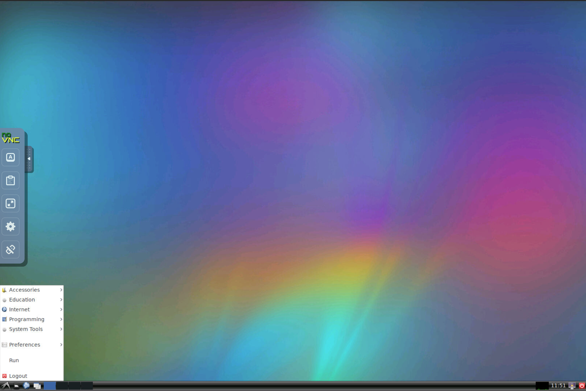
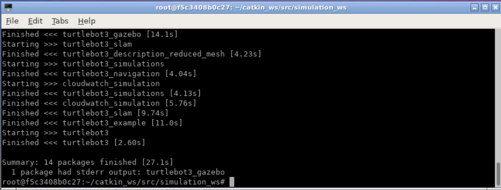
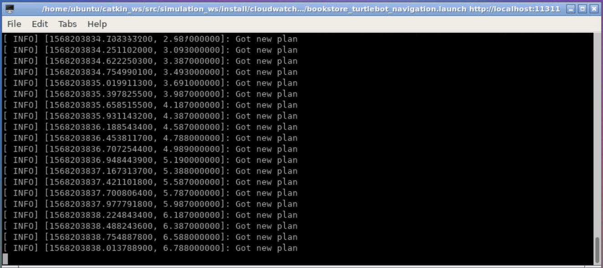
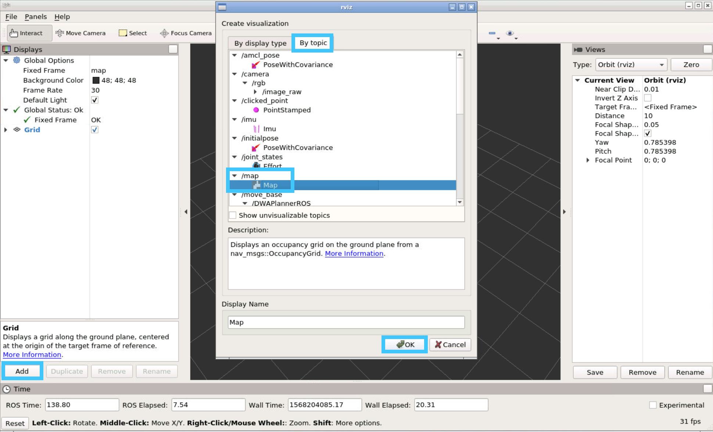
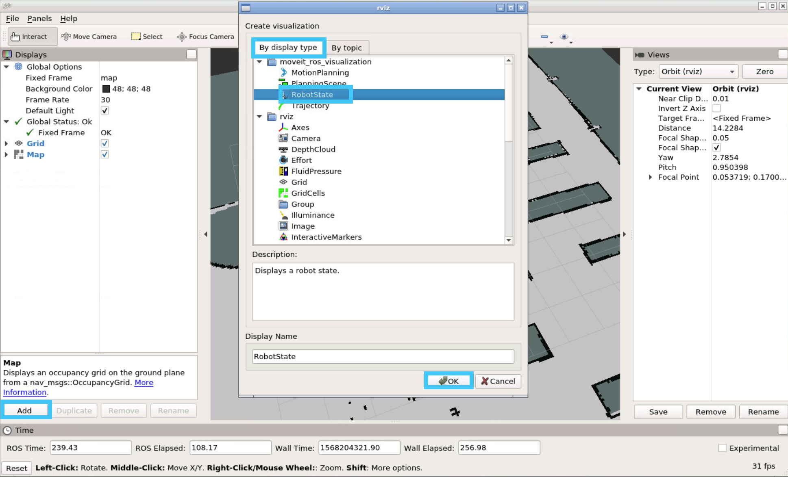
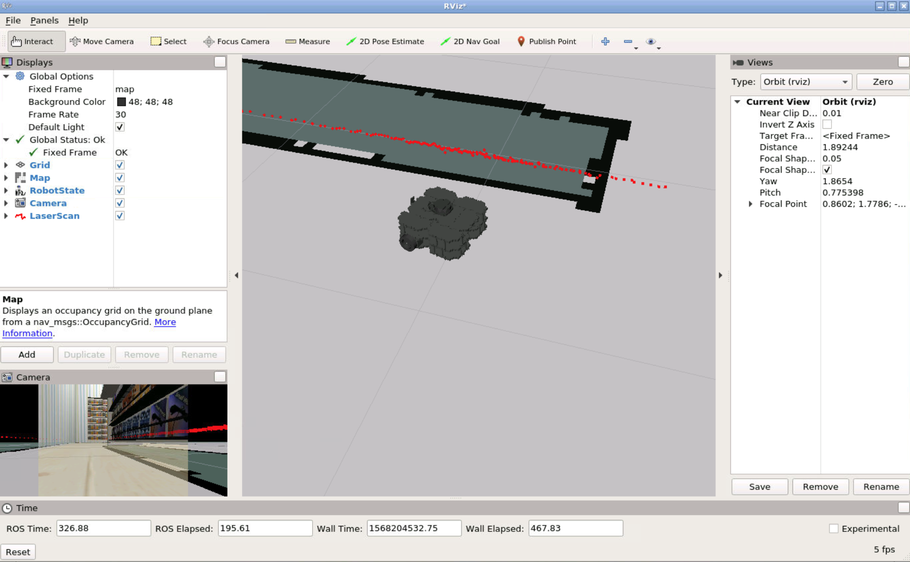
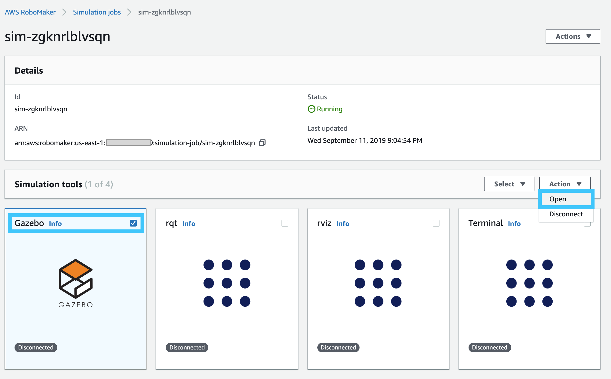

# AWS RoboMaker - Beginner's Guide to Robot Simulation

At first glance AWS RoboMaker might appear to be smoke and mirrors. That's certainly how I felt before I had given the service a good look this week.

AWS RoboMaker is a development, deployment and simulation platform for ROS (Robot Operating System). ROS has been around for a long time and is widely used throughout the Robotics industry. Because of its niche, and the fact that its usefulness isn't as apparent outside of industry; it's no surprise RoboMaker hasn't really caught many peoples attention in my Twitter circles.

## Introduction

The purpose of this post is to ultimately walk you through simulating ROS packages on AWS RoboMaker. While this isn't a new topic, I don't believe anyone has done it justice for the ultra beginners. We won't be writing any ROS modules, however I'll try to make you feel comfortable packaging up existing ones.

There is a huge collection of fantastic examples of RoboMaker configured ROS projects on the [AWS Robotics](https://github.com/aws-robotics) github. The project we work on in this post is interchangable with the ones there.

## Just Like the Simulations

At the heart of RoboMaker is the manager services for a couple pieces of software:

* [roscore](http://wiki.ros.org/roscore) - Collection of nodes and programs that are the pre-requisite for ROS-based systems. Nodes communicate with each other on an instance of roscore.
* [rviz](http://wiki.ros.org/rviz) - 3D visualization tool for ROS. During simulations we can use rviz to visualise what the robot is doing. RViz can also be used to communicate back to the robot, however this isn't something we'll be covering.
* [Gazebo](http://gazebosim.org/) - robot simulation with a proper physics engine.

RoboMaker will automatically setup all these pieces for you, which doesn't sound like a big deal; however if you've tried managing this stack of software yourself you'll be aware of how many moving parts there are.

## Dockerized Environment

For the project I've created a dockerized environment that can be used to fully simulate everything locally (Gazebo is the exception due to graphic passthrough limitations over VNC). Pull down the repository to start with

```bash
git clone https://github.com/t04glovern/aws-robomaker-docker
cd aws-robomaker-docker
```

To run the build and setup of an environment is as easy as running the following:

```bash
docker-compose up -d
```

Now go get a cup of coffee, because this will take some time. Once completed, running `docker ps -a` will reveal the following is running

```bash
$ docker ps -a
# CONTAINER ID        IMAGE                      COMMAND             CREATED             STATUS                            PORTS                                          NAMES
# f5c3408b0c27        aws-robomaker-docker_ros   "/startup.sh"       10 seconds ago      Up 9 seconds (health: starting)   0.0.0.0:5900->5900/tcp, 0.0.0.0:6080->80/tcp   catkin
```

Open up [http://localhost:6080](http://localhost:6080) in a browser and you should be presented with a VNC'd session of the environment



## Simulating Locally

To begin with lets simulate the ROS deployment locally. Fire up a terminal and run the following commands

```bash
# High level Project Workspace
cd /home/ubuntu/catkin_ws/src

# Simulation Workspace
cd simulation_ws

# Update Workspace & install dependencies
rosws update
rosdep install --from-paths src --ignore-src -r -y
```

Updating the workspace will pull down any external dependencies that aren't in the repo that might be needed. You can inspect what these are by opening the `.rosinstall` file in the `simulation_ws` Workspace. In this case you can see below what are required.

```bash
- git: {local-name: src/deps/aws-robomaker-bookstore-world, uri: "https://github.com/aws-robotics/aws-robomaker-bookstore-world", version: v0.0.1}
- git: {local-name: src/deps/turtlebot3, uri: "https://github.com/ROBOTIS-GIT/turtlebot3", version: d3cdcc6647812ae9a83f05e626cdae322923ac84}
- git: {local-name: src/deps/turtlebot3_simulations, uri: "https://github.com/ROBOTIS-GIT/turtlebot3_simulations", version: 1.2.0}
```

The final step is to build the local packages. For this we use colcon which will orchastrate all the necessary steps to build all the modules.

```bash
colcon build
```

If everything goes correctly, you should see the following



### Execute Simulation Locally

We're now ready to run the simulation locally. For this example we have the option to set what type of robot we'd like to use. This is done by setting an environment variable like so:

```bash
# Options are burger, waffle & waffle_pi
export TURTLEBOT3_MODEL=waffle_pi
```

Next setup your shell environment with all the necessary ROS workspace config

```bash
# Make sure you're in the workspace above `simulation_ws`
cd ../

# set environment configuration
source simulation_ws/install/local_setup.sh
```

There are two options for the simulation environment:

* `empty_world.launch` - Empty world with some balls surrounding the turtlebot at (0,0)
* `bookstore_turtlebot_navigation.launch` - A retail space where the robot navigates to random goals

Pick one of the above and run the following to launch the simulation

```bash
# Command
roslaunch cloudwatch_simulation [command]

# Example
roslaunch cloudwatch_simulation bookstore_turtlebot_navigation.launch
```

If all goes well you should see the following that indicates that the robot is simulating



### Viewing Simulation Locally

A terminal isn't very interesting, and the fun stuff is actually viewing the robot. This can be done using RViz. Open up a new terminal and run the following

```bash
rviz
```

You'll be greeted with a UI. From here you need to add the `Map` from the `topic`



And the RobotState from the basic display type



Have a play around, add in some other optional displays. Below is an example of `Camera` and `LaserScan` data.



Whem you're done, close down RViz and lets move onto the next step.

## Simulating on RoboMaker

To deploy to RoboMaker we'll need to bundle up everything that makes our robot special. This is done using colcon.

```bash
cd /home/ubuntu/catkin_ws/src/simulation_ws
source install/local_setup.sh
colcon bundle
```

This step takes a very long time (30+ minutes in some cases) as the bundler needs to pull down literally everything needed to run your robot from scratch.

Once completed it will spit out an output.tar file in `simulation_ws/bundle/output.tar`. We should pull this tar down to our local computer. This is done using the following docker command from your actual computer (not in the container)

```bash
docker cp catkin:/home/ubuntu/catkin_ws/src/simulation_ws/bundle/output.tar .
```

We will then need to upload this `.tar` to an S3 bucket to be used in the next steps. I'm going to be using my own bucket `devopstar`, you will need to make your own. This is done by running the following command

```bash
aws s3 mb s3://your-bucket-name
```

**NOTE**: *For the remainder of this tutorial I'll be using the following bucket and path for my files. Replace these references with your own*

* **bucket**: devopstar
* **key_path**: resources/aws-robomaker-kickstart

Upload the `tar` to S3 in a folder called `input`. The naming doesn't really matter, however it makes it easier to distinguish.

```bash
aws s3 cp output.tar s3://devopstar/resources/aws-robomaker-kickstart/input/simulation_ws.tar
```

### CDK Deploy

I've written a deployment of the RoboMakerSimulation and custom roles required using CDK, however this isn't necessary for the tutorial. If you want to know how to create the CloudFormation template used in this tutorial, you run run the following

```bash
# Install CDK
npm install -g aws-cdk

cd cdk/
npm install
npm run build

# Export a synthisized template
cdk synth --no-staging > template.yaml
```

If you want to deploy using CloudFormation, deploy the `cdk/template.yaml` file from either the CLI or Web interface. Your parameters will be different based on the bucket name and `.tar` location.

Take note of the outputs from the creation of the resources. You should recieve the following:

* **RoboMaker Role**: arn:aws:iam::123456789010:role/robomaker-simulator-simroleXXXXXXXXXXXXXXXXXX
* **RoboMaker Application ARN**: arn:aws:robomaker:us-east-1:123456789010:simulation-application/aws-robomaker-kickstart/1568206875172

### RoboMaker Simulation Job

The final step now is to run the Simulation job from the [RoboMaker console](https://console.aws.amazon.com/robomaker/home?region=us-east-1#simulationJobs). Unfortunately there's no simple way to deploy this piece with CloudFormation. Use the information from the previous step to create a version of the following json (available in `RoboMakerJob.json`)

```json
{
    "outputLocation": {
        "s3Bucket": "devopstar",
        "s3Prefix": "resources/aws-robomaker-kickstart/output/"
    },
    "maxJobDurationInSeconds": 3600,
    "iamRole": "arn:aws:iam::123456789010:role/xxxxxxxxxxxxxxxxxxxxxxxxxxxxxxxxxxxx",
    "failureBehavior": "Continue",
    "simulationApplications": [
        {
            "application": "arn:aws:robomaker:us-east-1:123456789010:simulation-application/aws-robomaker-kickstart/1568120923973",
            "applicationVersion": "$LATEST",
            "launchConfig": {
                "packageName": "cloudwatch_simulation",
                "launchFile": "bookstore_turtlebot_navigation.launch",
                "environmentVariables": {
                    "TURTLEBOT3_MODEL": "waffle_pi"
                }
            }
        }
    ],
    "tags": {
        "Project": "aws-robomaker-kickstart"
    }
}
```

Deploy the job using the CLI

```bash
aws robomaker create-simulation-job --cli-input-json file://RoboMakerJob.json
```

Head over to the [Web interface](https://console.aws.amazon.com/robomaker/home?region=us-east-1#simulationJobs) and check out the Simulation Job you just created

Once loaded up, open an instance of Gazebo



You should now be able to interact with the Simulation in a 3D space.


